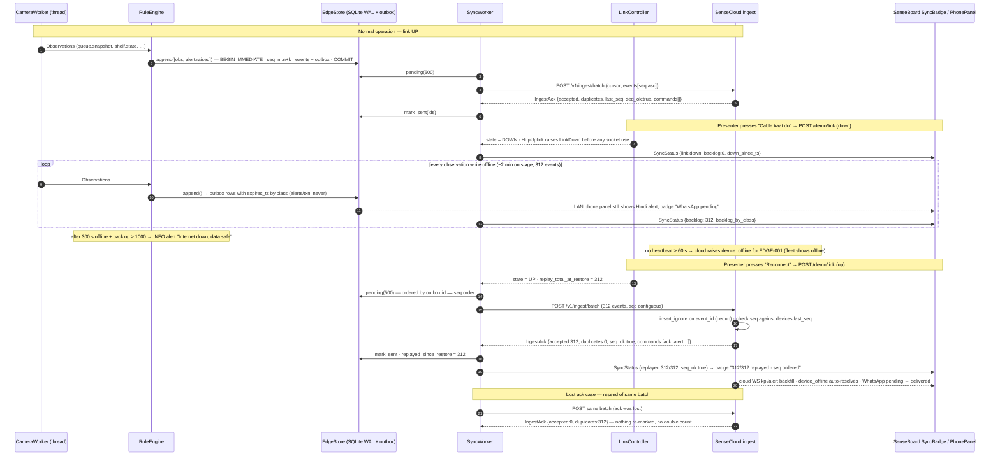
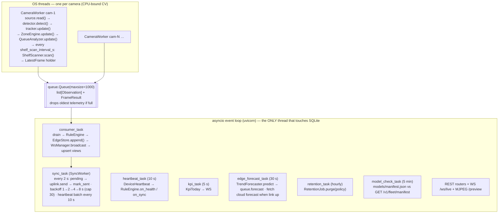
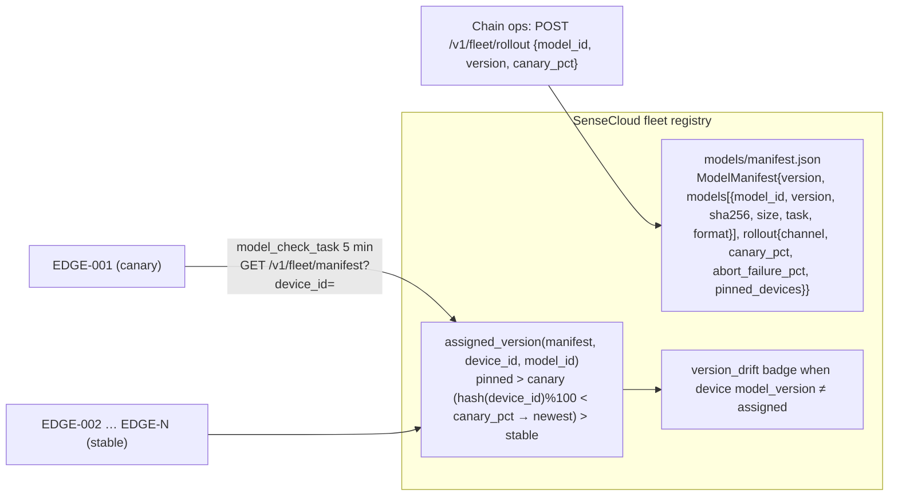

# RetailSense — System Architecture

**Problem statement:** Intelligent Retail Analytics System (AI-powered shopper analytics, inventory monitoring, queue intelligence, edge AI, privacy-aware, operations dashboard, scalable deployment).
**Product:** RetailSense = **SenseEdge** (per-store edge process) + **SenseCloud** (multi-store backend) + **SenseBoard** (Hindi/English phone-first dashboard).
**One line:** an offline-first edge-AI system that turns a kirana's existing CCTV into rupee-quantified shelf, queue and footfall intelligence — with no faces, no raw video leaving the store, and a live "cable cut" proof of store-and-forward.

This document is self-contained. Companion docs: `CONTRACTS.md` (wire formats), `PRIVACY.md`, `DECK.md`, `BMC.md`, `PITCH.md`.

---

## 1. System overview

| Layer | Component | Runs on | Role |
|---|---|---|---|
| Capture | RTSP / file / webcam / synthetic `FrameSource` | Edge | Pulls frames at 2–5 fps per camera from the DVR/NVR, an old Android phone, a file, or the agent-based synthetic store |
| Perception | `Detector` (synthetic colour-blob, YOLO11n ONNX CPU, Ultralytics fallback) + `ByteTrackLite` | Edge | Person boxes → ephemeral integer track IDs; no appearance embedding, no ReID |
| Analytics | `ZoneEngine`, `QueueAnalyzer`, `ShelfScanner` + `ShelfStateMachine`, `TrendForecaster` | Edge | Line-crossing footfall, zone occupancy, dwell, floorplan heatmap, queue length/wait/abandonment (Little's Law on service rate), shelf coverage with 3-scan persistence |
| Decision | `RuleEngine` + `impact.py` | Edge | Alerts with `impact_inr` and a cited basis string, pre-rendered in Hindi and English |
| Durability | `EdgeStore` (SQLite WAL, `synchronous=FULL`) + transactional outbox | Edge | Events and outbox rows committed in one transaction; per-device gap-free `seq`; per-class expiry |
| Uplink | `SyncWorker` → `HttpUplink` (primary) / `MqttUplink` (optional) | Edge → Cloud | Batches of ≤ 500 events, idempotent on `event_id`, ordered by `seq`; commands return in the ack |
| Backend | SenseCloud: ingest → aggregator → alerting → dispatcher → forecasting → integrations → fleet | Cloud (or a laptop) | KPIs, series, festival-aware forecasts, WhatsApp/Telegram notifications, Tally reconciliation, ONDC availability, OTA model manifest |
| Surface | SenseBoard (Vite + React 19 + TS + Tailwind) | Phone/laptop browser | `/owner` ("Aaj ka hisaab"), `/ops`, `/insights`, `/chain`, `/zones`; works on LAN with the cloud down |

Everything outside the store is **optional**. The edge alone delivers alerts on the LAN phone panel, KPIs, heatmaps and queue forecasts (edge trend model). The cloud adds chain views, gradient-boosted forecasts, WhatsApp delivery, Tally/ONDC and fleet management.

---

## 2. Component diagram

```mermaid
flowchart LR
  subgraph Store["Store (LAN, works with zero internet)"]
    CAM1["CCTV / DVR<br/>RTSP"]:::src
    CAM2["Old Android phone<br/>RTSP / webcam"]:::src
    CAM3["Synthetic store<br/>(agent-based sim, stage demo)"]:::src

    subgraph SE["SenseEdge (one Python process per store, :8001)"]
      direction TB
      CAP["FrameSource<br/>2–5 fps sampling"]
      DET["Detector<br/>synthetic / YOLO11n ONNX / ultralytics"]
      TRK["ByteTrackLite<br/>Kalman + 2-stage IoU, no ReID"]
      ZE["ZoneEngine<br/>lines · zones · dwell · heatmap"]
      QA["QueueAnalyzer<br/>Little's Law on service rate"]
      SS["ShelfScanner<br/>classical coverage · 3-scan persistence"]
      RE["RuleEngine<br/>alerts + ₹ impact + hi/en text"]
      DB[("SQLite WAL<br/>events + outbox<br/>one transaction")]
      SW["SyncWorker<br/>batch ≤500 · seq · backoff"]
      API["REST + WS + MJPEG<br/>(preview pixelated)"]
      CAP --> DET --> TRK --> ZE
      TRK --> SS
      ZE --> QA
      ZE --> RE
      QA --> RE
      SS --> RE
      RE --> DB --> SW
      DB --> API
    end
    PHONE_LAN["Owner's phone on LAN<br/>SenseBoard /owner"]:::ui
    CAM1 --> CAP
    CAM2 --> CAP
    CAM3 --> CAP
    API --> PHONE_LAN
  end

  subgraph Cloud["SenseCloud (:8000) — FastAPI, SQLite dev / Postgres+Timescale compose"]
    direction TB
    ING["Ingest<br/>POST /v1/ingest/batch<br/>idempotent on event_id · seq check"]
    AGG["Aggregator<br/>series_5m · kpi_daily · views"]
    ALT["Alerting<br/>mirror + device_offline + shrink"]
    DSP["Dispatcher<br/>Notifier (sim / Meta API / Telegram)"]
    FC["Forecasting<br/>HGB/LightGBM · festivals · salary week"]
    INTG["Integrations<br/>Tally XML · reconcile · ONDC stub"]
    FLT["Fleet<br/>registry · OTA manifest · canary"]
    ING --> AGG --> ALT --> DSP
    AGG --> FC
    AGG --> INTG
    ING --> FLT
  end

  SW -- "HTTP batch (primary)<br/>MQTT 5 QoS1 (optional)" --> ING
  ING -. "commands in IngestAck<br/>(ack_alert, model_update, …)" .-> SW

  BOARD["SenseBoard<br/>/owner /ops /insights /chain /zones"]:::ui
  WA["WhatsApp / Telegram<br/>1 = bhar diya · 2 = order · 3 = galat"]:::ext
  TALLY["Tally (XML :9000)<br/>stock summary · PO"]:::ext
  ONDC["ONDC seller catalog<br/>on_update availability"]:::ext

  AGG --> BOARD
  FLT --> BOARD
  DSP --> WA
  WA -- "digit reply → webhook" --> DSP
  INTG <--> TALLY
  INTG --> ONDC

  classDef src fill:#f4f4f4,stroke:#666,color:#111
  classDef ui fill:#e8f1ff,stroke:#2b5fb3,color:#111
  classDef ext fill:#fff4e0,stroke:#c27c00,color:#111
```

**Ports:** SenseCloud 8000 · SenseEdge 8001 · SenseBoard 5173 (dev) / 8080 (nginx) · Tally mock 9000 · Mosquitto 1883/9001 (compose profile) · Postgres 5432 (compose profile).

---

## 3. Offline-first: the "Cable kaat do" sequence

The edge is the source of truth. Every observation is written to SQLite together with its outbox row in **one** transaction, stamped with a per-device monotonic, gap-free `seq` and a hybrid logical clock (`hlc`). The cloud ingest is idempotent on `event_id` and reports `seq_ok` / `seq_gaps` in every ack, so a replay after an outage is verifiable on stage: **"312/312 replayed · seq ordered"**.

**Outbox policy (from `topics.EXPIRY_S`):**

| Event class | Examples | Expiry in outbox | Evictable on overflow (> `max_outbox_rows` = 50,000)? |
|---|---|---|---|
| `telemetry` | `heatmap.tiles`, `device.heartbeat`, `sim.truth` | 1 h | Yes (oldest first) |
| `aggregate` | `queue.snapshot`, `shelf.state`, `footfall.crossing` | 24 h | Yes (oldest first) |
| `alert` | `alert.raised/acked/resolved` | never | **Never** |
| `txn` | `stock.reconciled`, `order.requested` | never | **Never** |
| `config` | `config.applied` | 24 h | No |

This mirrors AWS Greengrass Stream Manager semantics: `OverwriteOldestData` for metrics, `RejectNewData` + high export priority for transactions (see DESIGN_BRIEF §5).

---

## 4. Edge process model (threads vs asyncio)

Why this split:

- **Threads for CV** because OpenCV/onnxruntime release the GIL inside native calls, so N cameras scale to N cores without multiprocessing overhead, and a blocking `source.read()` on RTSP does not stall the API.
- **Single-writer asyncio for SQLite** because SQLite has one writer at a time; routing every write through the loop thread removes lock contention and makes `append()` a clean `BEGIN IMMEDIATE … COMMIT` that stamps `seq`/`hlc`/`event_id` and inserts events + outbox rows atomically.
- **Back-pressure is explicit**: the bounded queue drops the oldest *telemetry* (never alerts) if the consumer falls behind, and the sync worker never blocks the consumer.
- **Graceful shutdown on Windows**: stop event → threads join ≤ 3 s → `store.close()`; the demo supervisor kills the process tree with `taskkill /T /F`.

---

## 5. Data model summary

All timestamps are epoch seconds UTC (`float`); dates are ISO strings in store timezone (`Asia/Kolkata`); money is INR.

**Event envelope** (`contracts.events.Event`): `event_id` (ULID) · `store_id` · `device_id` · `camera_id?` · `ts` (observation time) · `hlc` · `seq` (per-device, gap-free, starts at 1) · `type` · `cls` · `version` · `payload` (discriminated union of 16 payloads) · `created_ts`.

**Edge tables** (`contracts.db.edge_metadata`):

| Table | Purpose | Key |
|---|---|---|
| `events` | Append-only ledger of every observation | `event_id` PK; unique `(device_id, seq)` |
| `outbox` | Transactional outbox rows, one per event | `id` autoincrement (== seq order); `expires_ts`, `sent_ts`, `evicted_ts` |
| `device_state` | `seq_next`, `hlc_last`, `link_state`, replay stats, `config_version` | `key` |
| `alerts` | Alert documents + indexed columns | `alert_id`; partial unique `(kind, subject_id) WHERE status <> 'resolved'` |
| `shelf_state` | Current per-shelf state incl. `consecutive_empty_scans`, `fp_count`, calibration reference | `shelf_id` |
| `queue_state` | Latest snapshot + forecast per counter | `counter_id` |
| `heatmap_cells` | Floor-grid dwell/visits per hour bucket | `(camera_id, cell_x, cell_y, hour_bucket)` |
| `kpi_daily` | Day rollups (footfall, conversion, ATV, OSA, wait, lost/recovered ₹, shrink) | `(store_id, date)` |
| `sku_enrolment` | Few-shot SKU embeddings (P2) | `(sku_id, idx)` |

**Cloud tables** add: `stores`, `devices` (last_seq, model_version, status), `ingest_log` (per-batch audit with `seq_ok`), `commands`, `notifications`, `series_5m`, `agg_cursor`, `stock_recon`, `forecasts` (predicted vs actual for live MAE), `model_manifests`, `festivals`, `ondc_log`. The demo cloud runs on SQLite; the compose `pg` profile switches to Postgres + TimescaleDB via `SENSECLOUD_DB_URL` with no code change (`insert_ignore` maps to `ON CONFLICT DO NOTHING`).

**What is never stored:** raw frames, face crops, appearance embeddings, or track IDs in any event leaving the edge (`DwellSample` deliberately has no track id).

---

## 6. Hardware tiers and measured throughput

Detector throughput numbers are from `docs/research/EDGE_CV_STACK.md` (Ultralytics docs, LearnOpenCV, Hailo model zoo, NVIDIA). RetailSense samples 2–5 fps per camera (shelf scans need one frame per 30–60 s; queues need ~2 fps), so "cameras supported" is derived as detector FPS ÷ 4 fps, rounded down conservatively.

| Tier | Device | Indicative cost | Detector / runtime | Measured detector throughput (640 px) | Cameras at 4 fps sampling |
|---|---|---|---|---|---|
| Zero-hardware | Existing DVR/NVR RTSP + shopkeeper's old Android phone / any laptop | ₹0 | YOLO11n ONNX CPU | Ultralytics ref: 56.1 ms/img CPU ONNX (≈ 18 fps desktop CPU); RetailSense acceptance ≤ 120 ms/frame on the dev box | 1–2 |
| Kirana | Raspberry Pi 5 8 GB | ₹8–15k | YOLO11n: ONNX 6.4 fps, OpenVINO 12.4 fps; YOLO26n NCNN ≈ 15 fps | 6–15 fps | 1–2 |
| Kirana+ | Pi 5 + AI HAT+ (Hailo-8L, 13 TOPS) | included in ₹8–15k band (HAT extra) | yolov11n 157 fps, yolov8n 202 fps | 100–200 fps | 2–4 |
| Mini-supermarket | Jetson Orin Nano Super | $249 (≈ ₹22k) | TensorRT YOLO26n FP16 4.57 ms, INT8 3.80 ms | ≈ 219 fps FP16 | 8–16 |
| Chain store | Intel N100 mini-PC / NUC i5 + OpenVINO iGPU | ₹35–50k | N100 iGPU YOLO11n 21 fps; Core Ultra 7 155H YOLO26n 9.13 ms | 21–110 fps | 4–8 (N100) / 8–16 (Core Ultra) |
| Stage demo box | Windows 11 laptop, onnxruntime CPU build | – | Synthetic detector (HSV blob) ≫ 200 fps; YOLO11n ONNX CPU for webcam tile | sim renders > 200 fps; ONNX ≤ 120 ms/frame (acceptance) | 1 synthetic + 1 webcam |

Uplink bandwidth: only JSON events (gzip) and optional 96×96 shelf thumbnails (≤ 16 KB each, ≤ 1 per shelf per scan) leave the store — under ~1 kbit/s idle (DESIGN_BRIEF §5), i.e. a 2G/3G fallback is sufficient.

---

## 7. Security and privacy

| Concern | Mechanism |
|---|---|
| Device auth | `X-Device-Token` per device on `POST /v1/ingest/batch`; 401 unless `SENSECLOUD_DEV=1`; token stored in `store.yaml` device section |
| Integrity / ordering | ULID `event_id`, per-device gap-free `seq`, HLC; cloud `ingest_log` records `first_seq/last_seq/seq_ok` per batch |
| Idempotency | `insert_ignore` on `event_id`; resends report `duplicates`, never double-count |
| Transport | HTTPS via nginx in compose; MQTT over TLS optional; LAN edge API is CORS `*` by design (no secrets served) |
| Model governance | `models/manifest.json` with sha256 + size per model; `ModelManager.verify_sha()` before load; OTA rollout with canary and pinning |
| Privacy | No face recognition; appearance-free ByteTrack (no ReID); track IDs never leave the edge; preview frames pixelate people (down 12× / up) and are never written to disk; thumbnails are shelf-polygon-only, 96×96; retention purge job; see `PRIVACY.md` |
| Data minimisation | Events carry counts, durations and states — not images or identities; heatmap is a 20 px floor grid per hour |
| Blast radius | Cloud down → edge fully functional on LAN; edge down → cloud raises `device_offline` within 60 s and the fleet view shows it honestly |

---

## 8. Scaling from one kirana to a chain

- **Registry**: `POST /v1/stores` registers a `StoreConfig`; every heartbeat updates `devices` (fps, backlog, link, model_version). `GET /v1/fleet` → online/offline counts and per-device status.
- **OTA manifest**: canary → 10 % → 50 % → 100 % with abort at 5 % failures and per-device pinning (DESIGN_BRIEF §5 pattern: balena/Mender); a device compares the local manifest against the cloud every 5 minutes and reports `update_available`.
- **Chain view**: `GET /v1/chain/rank?metric=osa_pct|avg_wait_s|lost_sales_inr|footfall_in|conversion_pct` ranks stores, normalised per 100 visitors so a small store is not punished for low volume.
- **Multi-store demo**: two headless `FakeEdge` simulators (`STR-MH-002`, `STR-KA-003`) post real `IngestBatch`es so chain and fleet views show three devices on stage.
- **Backend growth path**: SQLite (dev) → Postgres + TimescaleDB (`pg` profile) → Kafka/Redis Streams in front of ingest when a single FastAPI worker saturates (design reference in DESIGN_BRIEF §5). The ingest contract (`IngestBatch`/`IngestAck`) does not change.
- **Per-store isolation**: each store's `seq` space, alerts, and KPI rollups are independent; `agg_cursor` makes aggregation incremental per store.

---

## 9. Deployment

| Mode | Command | What runs |
|---|---|---|
| Stage demo | `python -m retailsense demo` | SenseCloud (sqlite, seeded 30 days, forecasters trained in 2–4 s) → Tally mock :9000 → SenseEdge with `store_demo.yaml` (`synthetic:baseline`, clock ×10, HTTP uplink) → 2 headless stores → SenseBoard dev server → browser opens `/owner` |
| Real camera | `python -m retailsense demo --camera webcam:0 --detector onnx` | Adds a live camera tile using `models/yolo11n.onnx` (fetched once at setup) |
| Docker | `docker compose up` | `cloud`, `edge`, `board` (nginx :8080), `tally-mock` |
| Docker + broker | `docker compose --profile broker up` | adds Mosquitto (1883 / ws 9001); edge uplink switches to `mqtt` |
| Docker + Postgres | `docker compose --profile pg up` | `timescale/timescaledb`, `SENSECLOUD_DB_URL=postgresql+psycopg://…` |
| Edge appliance | `deploy/edge.Dockerfile` (python:3.11-slim + opencv-headless) under balenaOS / Greengrass | one container per store, `var/` volume for SQLite |

CI (`.github/workflows/ci.yml`): ubuntu + windows matrix, Python 3.11 pytest (`-m "not slow and not gpu"`), Node 22 vitest + build, ruff, and a TypeScript types drift check (`tools/gen_ts_types.py` output must match the committed file).

---

## 10. Key design decisions and rationale

| # | Decision | Alternatives considered | Why |
|---|---|---|---|
| 1 | **Synthetic agent-based store is the primary demo source; YOLO11n ONNX is the real-video path** | Demo on a recorded store video; demo on a live webcam only | A stage demo must be deterministic and *assertable*: the simulator's `sim.truth` gives ground truth so `tests/test_e2e_synthetic.py` asserts footfall within ±10 % and exactly one `shelf_gap` alert. The *same* CV pipeline (tracker, zone engine, shelf estimator, rules, store, sync) consumes synthetic frames, so nothing is mocked downstream of the detector. A webcam tile with ONNX YOLO11n proves real video works; scenarios (evening rush, stockout, cable cut) can be triggered on demand instead of waiting for a real queue to form. |
| 2 | **HTTP batch sync is the primary uplink; MQTT 5 is optional** | MQTT-only (as in the research brief) | One FastAPI endpoint with `IngestBatch`/`IngestAck` gives idempotency, seq verification and command delivery in one round trip, needs no broker on stage, works through any proxy/4G NAT, and is testable in-process with `httpx`. MQTT 5 (QoS1, persistent session, per-class Message Expiry, LWT) is kept behind `uplink.mode=mqtt` for deployments that already run a broker; the outbox expiry table is shared by both. |
| 3 | **Classical shelf coverage estimator + 3-scan persistence** | Fine-tuned YOLO gap detector (Roboflow empty-shelf sets, Sensors 2024 two-class model) | The classical estimator (Lab colour distance to calibrated backing + local texture variance, column profile along the shelf's long axis, facings from covered runs) needs **no trained weights**, calibrates with one click on the live frame, and is explainable to a judge. The 3-consecutive-scan rule (30–60 s scans) separates replenishment-in-progress and occlusion from true out-of-stock (Trax/Focal practice); occluded scans are skipped rather than reset; a "3 = galat alert" reply raises that shelf's persistence to 4, 5, 6 — self-tuning false-positive control. A learned gap detector plugs in behind the same `CoverageEstimator` protocol for P1/P2. |
| 4 | **Little's Law on the measured *service* rate** (`wait = L / service_rate`) | Little's Law on arrival rate; per-person observed waits only | A queue's wait depends on how fast the cashier clears it, not how fast people join; the service rate is measured directly from counter-line crossings (IN events on `counter-1-line`). Arrival rate is still recorded for forecasting. Fallback chain when fewer than 0.2 served/min are observed: mean of the last 5 observed waits → `count × default_service_s`. A 5 s minimum in-zone age filters ID-switch ghosts, and abandonment (left the zone without crossing the counter line) is counted explicitly. |
| 5 | **Rupee impact on every alert** | Severity labels only | Kirana owners act on money, not on "HIGH". `ImpactInr{lost_sales_inr, lost_margin_inr, basis, factor, source}` uses `mrp × velocity × gap_h × 0.31`, where 0.31 is the share of shoppers who buy elsewhere on a stock-out (Gruen, Corsten & Bharadwaj 2002, GMA/FMI, 71k shoppers, 29 countries). The `basis` string ("₹27 × 18/hr × 0.33 h × 0.31") is shown in the message and the dashboard tooltip, and the factor is editable in `store.yaml`. Resolution computes `recovered_inr` against a 120-minute unattended-gap baseline, so the owner sees "₹ बचाया आज", which is the number the business model is sold on. |
| 6 | **Edge-rendered Hindi + English alert text** | Render on the cloud / in the UI | Alerts must be complete while offline: the LAN phone panel shows the final WhatsApp text with the digit menu even with the cable cut; the cloud dispatcher simply forwards `message_hi`/`message_en`. |
| 7 | **Contracts package with fakes + registry** | Direct imports between packages | 14 disjoint packages coded against one frozen `retailsense_contracts 1.0.0`; `registry.resolve()` falls back to deterministic fakes so every package tests alone, and the integrator flips to real implementations by installing them. TypeScript types are generated from the pydantic models and drift-checked in CI. |
| 8 | **sklearn HistGradientBoosting default, LightGBM optional** | LightGBM/CatBoost mandatory | Installs on the dev box with no compiler; one model per horizon (5/10/15/30 min) with holdout MAE reported next to a naive-persistence baseline, surfaced as a live badge on the QueueLane. LightGBM is used automatically when importable. |
