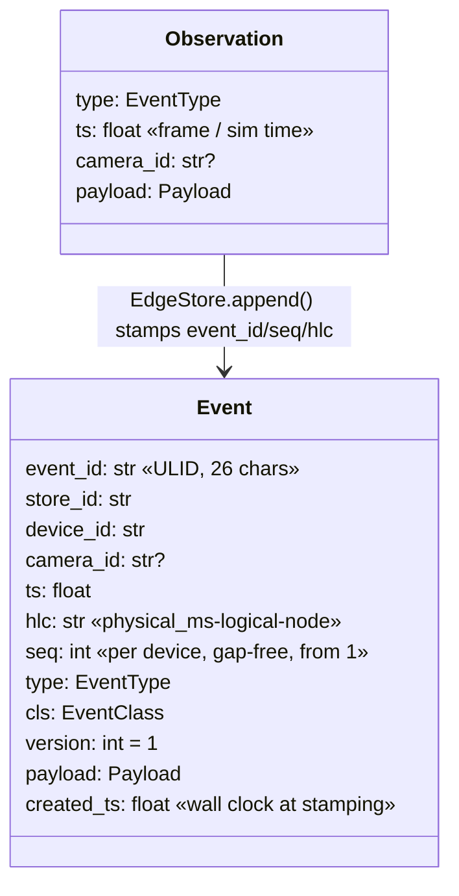
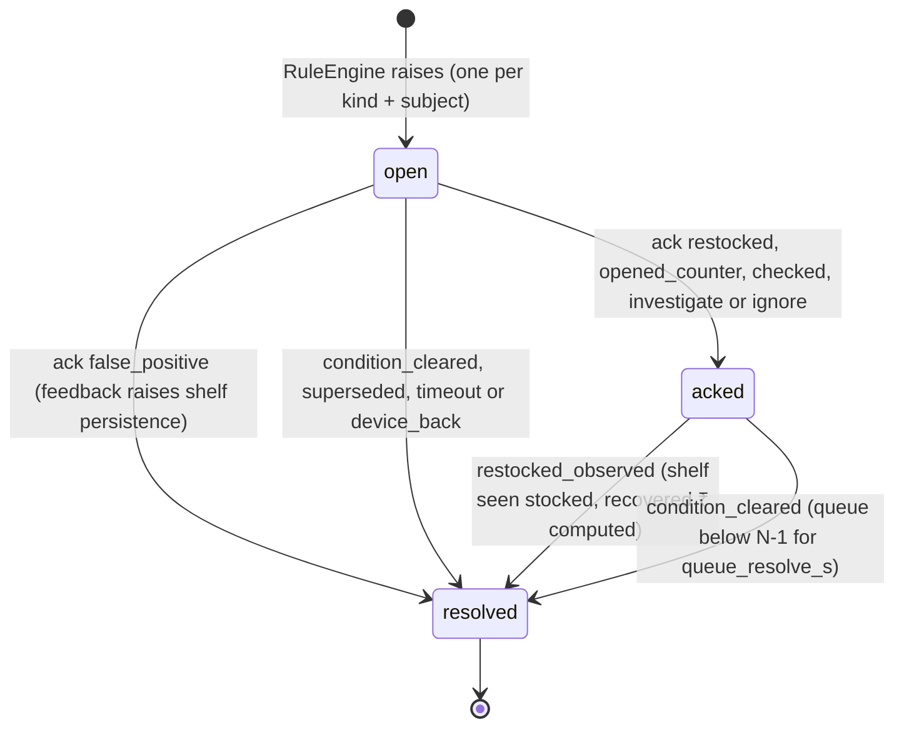

# RetailSense — Contracts Guide (`retailsense_contracts` 1.0.0)

A human-readable companion to `packages/contracts`. Every package in the monorepo (sim, edgecv, edgeshelf, edgeanalytics, edgequeue, edgerules, edgestore, edgeuplink, forecasting, integrations, senseedge, sensecloud, senseboard) codes **only** against this package; `registry.resolve(key)` swaps real implementations for deterministic fakes when a sibling package is not installed. Once tagged `VERSION = "1.0.0"` the package is frozen; changes go by PR with integrator sign-off.

Conventions: timestamps are **epoch seconds UTC as `float`** (fields named `ts` or ending in `_ts`); dates are ISO `YYYY-MM-DD` in store timezone (`Asia/Kolkata`); coordinates are image pixels `[x, y]` of the owning camera (floorplan coordinates are pixels of the floorplan canvas); money is INR, rounded to 2 dp on render; every model is `extra="forbid"` except free-form `params`/`details` dicts.

---

## 1. Event envelope



- **Producers emit `Observation`s**; only `EdgeStore.append()` turns them into `Event`s, in one SQLite transaction that also writes the outbox row. This is why `seq` is gap-free even across crashes.
- `cls` is derived from `type` via `EVENT_CLASS` and validated; a mismatch between `type` and `payload.type` is rejected.
- `hlc` (hybrid logical clock) merges remote timestamps on receive so cloud-side ordering is causal even when an edge clock drifts.

## 2. Event types

| `type` | Class | Payload model | Produced by | Consumed by |
|---|---|---|---|---|
| `footfall.crossing` | aggregate | `FootfallCrossing{line_id, line_kind, direction, count=1}` | `ZoneEngine` LineCrosser (edgeanalytics) | `QueueAnalyzer` (counter-line IN = served), edge `kpi_today` (footfall in/out, occupancy), cloud aggregator (footfall series, conversion = counter IN ÷ entrance IN) |
| `zone.occupancy` | aggregate | `ZoneOccupancy{zone_id, zone_kind, count, window_s}` | `ZoneEngine` every `occupancy_interval_s` | edge KPI `occupancy_now`, cloud `series_5m`, STAR/bounce on `/insights` |
| `dwell.sample` | aggregate | `DwellSample{zone_id, dwell_s, entered_ts, exited_ts}` — no track id | `ZoneEngine` on zone exit / track loss (≥ 1 s) | cloud aggregator (dwell by zone, bounce rate) |
| `heatmap.tiles` | telemetry | `HeatmapTiles{cell_px, width_cells, height_cells, tiles[{cell_x, cell_y, hour_bucket, dwell_s, visits}]}` — deltas | `HeatmapAccumulator` flush every `heat_flush_s` | `EdgeStore.heat_add`, cloud `heatmap_cells`, `/insights` heatmap |
| `queue.snapshot` | aggregate | `QueueSnapshot{counter_id, count, avg/max_dwell_s, arrival_rate_pm, service_rate_pm, est_wait_s, method, served/abandoned window+total, long_since_ts}` | `QueueAnalyzer` every `snapshot_interval_s` or when \|Δcount\| ≥ 2 | `RuleEngine.on_queue`, `TrendForecaster.observe`, cloud series + forecasts `actual` fill, QueueLane |
| `queue.forecast` | aggregate | `QueueForecast{counter_id, made_ts, horizons{"5","10","15","30"}, model: edge_trend/cloud_gbm, mae_recent}` | edge `edge_forecast_task` (TrendForecaster) or cloud forecaster via `set_cloud_forecast` | `RuleEngine` (queue_forecast rule), QueueLane arrow + MAE badge |
| `shelf.scan` | aggregate | `ShelfScan{shelf_id, sku_id, coverage, facings, capacity_facings, state_raw, occluded, method, thumb_b64 ≤ 16 KB}` | `ShelfScanner` every `shelf_scan_interval_s` | `ShelfStateMachine.apply`, `/shelves/{id}/thumb.jpg` |
| `shelf.state` | aggregate | `ShelfStateChange{shelf_id, sku_id, from_state, to_state, gap_started_ts, gap_minutes, consecutive_empty_scans, impact}` | `ShelfStateMachine` on confirmed transition | `RuleEngine.on_shelf_change`, cloud aggregator (OSA %, gap minutes), ONDC availability publish |
| `alert.raised` | alert | `AlertRaised{alert}` | `RuleEngine` (edge) / `alerting.py` (cloud-only kinds) | cloud alert mirror, dispatcher → WhatsApp/Telegram, board AlertFeed + PhonePanel |
| `alert.acked` | alert | `AlertAcked{alert_id, action, by, note}` | `RuleEngine.on_ack` (board, WhatsApp digit, cloud command) | cloud alert status, board |
| `alert.resolved` | alert | `AlertResolved{alert_id, reason, final_gap_minutes, impact_final, recovered}` | `RuleEngine` when condition clears / FP / superseded | cloud KPI `recovered_inr`, board "₹ बचाया" |
| `device.heartbeat` | telemetry | `DeviceHeartbeat{uptime_s, fps, infer_ms_p50/p95, detector, model_version, backlog, link, cameras[CameraHealth], contracts_version, clock_factor, sim_ts, cpu_pct, mem_mb}` | senseedge `heartbeat_task` (10 s) | cloud `devices` row, fleet view, `device_offline` rule (no heartbeat > 60 s) |
| `stock.reconciled` | txn | `StockReconciled{sku_id, shelf_id, visual_units, system_units, delta_units, delta_inr, source}` | `integrations.reconcile()` (cloud) | `stock_recon` table, ShrinkTable, `shrink_suspect` alert |
| `order.requested` | txn | `OrderRequested{sku_id, qty, channel, alert_id, est_cost_inr}` | `RuleEngine.on_ack(order)` or board "Tally में PO बनाओ" | cloud `POST /v1/stores/{id}/orders` → `ErpClient.post_purchase_order` |
| `config.applied` | config | `ConfigApplied{config_version, config_hash}` | edge config router on `PUT /config/*` | cloud `stores.config` |
| `sim.truth` | telemetry | `SimTruth{in_store, queue_counts, shelf_units, shelf_facings, served_total, abandoned_total, footfall_in_total, scenario}` | `SyntheticFrameSource` | integration tests, `GET /demo/truth` (never used by rules) |

## 3. Alerts

`Alert{alert_id, store_id, device_id, origin, kind, severity, status, subject_id, title_en, title_hi, message_en, message_hi, details, impact, actions, raised_ts, acked_ts, resolved_ts, ack_action, ack_by}`.

- **Uniqueness**: one non-resolved alert per `(kind, subject_id)` — enforced by a partial unique index on both edge and cloud.
- **Actions menu** (`ACTIONS_BY_KIND`): WhatsApp digit *i* maps to `actions[i-1]`.

| Kind | Subject | Severity rule | Actions (digits 1, 2, 3) | Impact |
|---|---|---|---|---|
| `shelf_gap` | `shelf_id` | HIGH if `rate_per_hour ≥ ₹50` else WARN; CRITICAL if gap ≥ 60 min at raise | restocked · order · false_positive | `lost_sales(sku, gap_so_far)` |
| `queue_long` | `counter_id` | WARN; CRITICAL if `count ≥ max_queue` | opened_counter · ignore | `queue_abandon_risk(count, threshold)` |
| `queue_forecast` | `counter_id` | INFO | opened_counter · ignore | – |
| `camera_down` | `camera_id` | HIGH | checked | – |
| `sync_backlog` | `device_id` | INFO | – | – |
| `device_offline` (cloud) | `device_id` | HIGH | – | – |
| `shrink_suspect` (cloud) | `sku_id` | WARN | investigate · false_positive | `delta_inr` |
| `footfall_spike` | `store_id` | INFO | – | – |

### Alert lifecycle



`AlertResolved.reason ∈ {condition_cleared, restocked_observed, false_positive, superseded, timeout, device_back}` and carries `final_gap_minutes`, `impact_final` and `recovered`. Ack sources: board button, WhatsApp digit (simulator or Meta webhook), Telegram callback, or a cloud `Command{ack_alert}` delivered in the next ingest ack.

An `order` ack additionally emits `order.requested` (qty suggested from `velocity × lead_time_days`) and keeps the alert `acked` until the shelf is observed restocked.

### Impact formula (`impact.py`, the single source of truth)

| Function | Formula | Demo numbers |
|---|---|---|
| `rate_per_hour(sku)` | `mrp × velocity_units_per_hr × lost_sale_factor` | Amul Taaza: 27 × 18 × 0.31 = ₹150.66/h |
| `lost_sales(sku, gap_min)` | `rate_per_hour × gap_min/60`; margin = × `margin_pct/100` | 20 min gap → ₹50.22 (basis `"₹27 × 18/hr × 0.33 h × 0.31"`) |
| `recovered(sku, actual_gap_min)` | `rate_per_hour × max(0, baseline_unattended_gap_min − actual)/60` | 8 min gap vs 120 min baseline → ₹281.23 |
| `queue_abandon_risk(count, threshold)` | `max(0, count − threshold + 1) × queue_abandon_factor × atv_inr` | 6 waiting, threshold 4 → 3 × 0.32 × ₹180 = ₹172.80 |

Defaults: `lost_sale_factor 0.31` (Gruen, Corsten & Bharadwaj 2002, GMA/FMI, 71k shoppers: 31 % buy elsewhere, 9 % abandon), `queue_abandon_factor 0.32`, `atv_inr 180` (overridden by Tally `sales_today` when connected), `baseline_unattended_gap_min 120`.

## 4. MQTT topic scheme (optional uplink)

| Topic | Payload | Notes |
|---|---|---|
| `rs/v1/{store_id}/{device_id}/{cls}` | one `Event` JSON per message | `cls ∈ telemetry, aggregate, alert, txn, config`; QoS 1; MQTT 5; `clean_start=False`; session expiry 7 days |
| `rs/v1/{store_id}/{device_id}/status` | `"online"` / `"offline"` | retained, LWT |
| `rs/v1/{store_id}/{device_id}/cmd` | `Command` JSON | cloud → device (`ack_alert`, `apply_config`, `set_link`, `set_scenario`, `model_update`, `ping`) |

**Expiry policy** (`EXPIRY_S`, applied as MQTT 5 `MessageExpiryInterval` and as the outbox `expires_ts`): telemetry 3600 s · aggregate 86400 s · alert **never** · txn **never** · config 86400 s. `EVICTABLE = (telemetry, aggregate)`: on outbox overflow the oldest evictable rows are dropped; alert/txn rows are never evicted or expired.

## 5. REST endpoints

### SenseEdge `:8001` (LAN, zero internet; JSON; CORS `*`)

| Method & path | Request → Response |
|---|---|
| GET /health | → HealthStatus |
| GET /config · PUT /config/zones · PUT /config/shelves · PUT /config/rules | ZonesUpdate / ShelvesUpdate / RulesConfig → StoreConfig (bumps config_version, persists yaml, hot-reloads analytics; emits config.applied) |
| GET /kpis/today · GET /kpis/series?metric=queue_count\|est_wait_s\|footfall_in\|occupancy\|osa_pct&minutes=60 | → KpiToday / Series |
| GET /alerts?status=open\|acked\|resolved\|all&limit=100 · POST /alerts/{id}/ack | AlertAckRequest → Alert |
| GET /queues · GET /shelves · GET /shelves/{id}/thumb.jpg | → list[QueueView] / list[ShelfStateView] / image |
| GET /heatmap?camera_id=&from_ts=&to_ts= | → HeatmapResponse (floor coords) |
| GET /floorplan.png · GET /preview/{camera_id}.mjpg · GET /preview/{camera_id}.jpg?annotate=1 | images, never persisted; people pixelated if privacy.preview_blur_people |
| POST /calibrate/shelves/{shelf_id}/reference · POST /calibrate/shelves/reference-all | → ShelfReference / list[ShelfReference] |
| POST /sku/enrol (multipart sku_id, images[]) | → SkuEnrolResponse |
| GET /sync · POST /sync/flush · POST /demo/link | LinkRequest → SyncStatus |
| GET /demo/scenarios · POST /demo/scenario · POST /demo/chaos · POST /demo/restock/{shelf_id} · GET /demo/truth | ScenarioRequest/ChaosRequest → ScenarioStatus / SimTruth (404 when no synthetic camera) |
| POST /demo/whatsapp/reply | WhatsAppReply → Alert (maps digit→actions[digit−1], by=whatsapp_sim) |
| GET /summary/daily?lang=hi | → DailySummary |
| GET /models · POST /models/check | → ModelStatus (compares models/manifest.json with cloud GET /v1/fleet/manifest) |
| GET /metrics | Prometheus text (P2) |
| WS /ws/live | WsMessage stream (§6) |

### SenseCloud `:8000`

| Method & path | Request → Response |
|---|---|
| POST /v1/ingest/batch (header X-Device-Token) | IngestBatch → IngestAck (idempotent on event_id; 401 bad token unless SENSECLOUD_DEV=1; 413 > 500 events) |
| POST /v1/stores (StoreConfig) · GET /v1/stores · GET /v1/stores/{id} | → Store |
| GET /v1/stores/{id}/kpis?range=today\|7d\|30d · GET /v1/stores/{id}/series?metric=&range=today\|7d | → KpiRange / Series |
| GET /v1/stores/{id}/alerts?status= · POST /v1/alerts/{id}/ack | AlertAckRequest → Alert (also enqueues Command ack_alert for the device) |
| GET /v1/stores/{id}/queues · /shelves · /heatmap?from_ts&to_ts | as edge views, from cloud tables |
| GET /v1/stores/{id}/forecast/queue?counter_id= · /forecast/footfall?days=7 · /forecast/eval | → QueueForecast / FootfallForecast / list[FitReport] |
| GET /v1/stores/{id}/reorder | → list[ReorderSuggestion] |
| GET /v1/stores/{id}/reports/daily?date=&format=json\|csv\|whatsapp&lang= | → DailyReport / text |
| GET /v1/stores/{id}/recon · POST /v1/stores/{id}/integrations/tally/reconcile · POST /v1/stores/{id}/integrations/ondc/publish · GET /v1/stores/{id}/integrations/status | → list[StockReconciled] / ReconcileReport / OndcAck / IntegrationsStatus |
| POST /v1/stores/{id}/orders (OrderRequested) | → {po_id} via ErpClient.post_purchase_order |
| GET /v1/chain/rank?metric=osa_pct\|avg_wait_s\|lost_sales_inr\|footfall_in\|conversion_pct&date= | → ChainRank (normalised = value per 100 visitors where meaningful) |
| GET /v1/fleet · GET /v1/fleet/manifest?device_id= · POST /v1/fleet/manifest · POST /v1/fleet/rollout · GET /v1/devices/{id}/commands | → FleetView / ModelManifest / … / list[Command] |
| GET /v1/whatsapp/outbox?store_id=&limit= · POST /v1/whatsapp/webhook (WhatsAppReply or Meta payload) · GET /v1/notifications?store_id= | → list[OutboundMessage] / {ok, alert_id, action} |
| POST /mock/ondc/on_update · GET /mock/ondc/log | Beckn-shaped JSON → {ack:{status:"ACK"}} |
| GET /health · WS /v1/ws?store_id= | |

**Tally mock `:9000`** (`python -m retailsense_integrations.tally_mock`): `POST /` Tally XML envelope (Export → StockSummary / Sales vouchers; Import → Stock Journal, Purchase Order) · `GET/PUT /mock/state` JSON `{items: {name: {qty, rate, sold_today}}}`. Default state: Amul Taaza 500ml 48, Parle-G 70g 120, Fortune Sunflower 1L 18.

### Ingest batch and ack

```text
IngestBatch {batch_id, device_id, store_id, sent_ts, cursor, events[≤500, seq ascending], backlog, contracts_version}
IngestAck   {batch_id, accepted, duplicates, rejected[{event_id, reason}], last_seq, seq_ok, seq_gaps[], commands[Command], server_ts}
```

The ack doubles as the command channel: a WhatsApp reply on the cloud becomes a `Command{kind: ack_alert}` that the device receives in its next (possibly empty) heartbeat batch, so no inbound port is ever opened on the store's network.

## 6. WebSocket message kinds

`WsMessage{kind, ts, store_id?, data}`.

| Socket | Kinds emitted | Cadence |
|---|---|---|
| Edge `WS /ws/live` | `hello{device_id, store_id, contracts_version}` · `event{Event}` (all non-telemetry) · `alert{Alert}` · `kpi{KpiToday}` · `health{HealthStatus}` · `sync{SyncStatus}` · `scenario{ScenarioStatus}` · `forecast{QueueForecast}` | kpi 5 s · health 10 s · sync on change + every 2 s while replaying · others on occurrence |
| Cloud `WS /v1/ws?store_id=` | `hello` · `alert` · `kpi` · `device{DeviceStatus}` · `notification{OutboundMessage}` · `forecast` · `sync{device_id, last_seq, seq_ok, accepted}` | on occurrence |

SenseBoard subscribes to the edge socket first (works on LAN with no cloud) and polls REST every 5 s as a fallback; the cloud socket feeds `/chain`, `/insights` and delivered-status on the PhonePanel.

## 7. `store.yaml` walkthrough (the canonical demo config)

```yaml
schema_version: 1
store: {store_id: STR-DL-001, name: "Ramesh General Store", lang: hi, tz: Asia/Kolkata, tier: kirana, owner_whatsapp: "+919999900001"}
device: {device_id: EDGE-001, token: demo-token-001, edge_port: 8001, cloud_url: "http://localhost:8000", db_path: var/senseedge.db,
         uplink: {mode: http, batch_size: 500, interval_s: 2.0, heartbeat_s: 10}}
floorplan: {width_px: 640, height_px: 360, scale_m_per_px: 0.02, heat_cell_px: 20}
cameras:
  - {camera_id: cam-synth, source: "synthetic:baseline", width: 640, height: 360, fps_sample: 4, detector: auto, anchor: center, shelf_scan_interval_s: 30, preview_blur_people: false}
zones:
  - {zone_id: store,   camera_id: cam-synth, kind: store, polygon: [[20,20],[620,20],[620,340],[20,340]]}
  - {zone_id: aisle-1, camera_id: cam-synth, kind: aisle, name: "Biscuits & Dairy aisle", polygon: [[130,70],[430,70],[430,200],[130,200]]}
  - {zone_id: aisle-2, camera_id: cam-synth, kind: aisle, name: "Oil aisle", polygon: [[70,130],[125,130],[125,300],[70,300]]}
  - {zone_id: queue-1, camera_id: cam-synth, kind: queue, name: "Counter queue", polygon: [[540,98],[612,98],[612,300],[540,300]]}
lines:
  - {line_id: entrance,       camera_id: cam-synth, kind: entrance, start: [120,315], end: [60,315]}    # IN = moving up (y decreasing)
  - {line_id: counter-1-line, camera_id: cam-synth, kind: counter,  start: [532,98],  end: [532,142]}   # IN = served, moving left out of queue head
counters:
  - {counter_id: counter-1, name: "Main counter", queue_zone_id: queue-1, counter_line_id: counter-1-line, max_queue: 8, default_service_s: 45}
shelves:
  - {shelf_id: shelf-A, camera_id: cam-synth, name: "Dairy",    polygon: [[130,30],[270,30],[270,62],[130,62]], sku_id: AMUL-TAAZA-500, capacity_facings: 9, min_facings: 2, facing_width_px: 15}
  - {shelf_id: shelf-B, camera_id: cam-synth, name: "Biscuits", polygon: [[290,30],[430,30],[430,62],[290,62]], sku_id: PARLE-G-70,     capacity_facings: 9, min_facings: 2, facing_width_px: 15}
  - {shelf_id: shelf-C, camera_id: cam-synth, name: "Oil",      polygon: [[30,130],[62,130],[62,300],[30,300]], sku_id: FORTUNE-OIL-1L, capacity_facings: 7, min_facings: 1, facing_width_px: 22}
skus:
  - {sku_id: AMUL-TAAZA-500, name_en: "Amul Taaza 500ml", name_hi: "अमूल ताज़ा 500ml", mrp_inr: 27, margin_pct: 8,  velocity_units_per_hr: 18, units_per_facing: 4, lead_time_days: 1, tally_item_name: "Amul Taaza 500ml", ondc_item_id: I-AMUL-500}
  - {sku_id: PARLE-G-70,     name_en: "Parle-G 70g",      name_hi: "पारले-जी 70g",     mrp_inr: 10, margin_pct: 12, velocity_units_per_hr: 8,  units_per_facing: 4, lead_time_days: 2, tally_item_name: "Parle-G 70g",      ondc_item_id: I-PARLEG-70}
  - {sku_id: FORTUNE-OIL-1L, name_en: "Fortune Sunflower Oil 1L", name_hi: "फॉर्च्यून तेल 1L", mrp_inr: 150, margin_pct: 6, velocity_units_per_hr: 2, units_per_facing: 2, lead_time_days: 3, tally_item_name: "Fortune Sunflower 1L", ondc_item_id: I-FORTUNE-1L}
rules: {persistence_scans: 3, queue_long_count: 4, queue_long_s: 60, queue_forecast_threshold: 6}
impact: {lost_sale_factor: 0.31, atv_inr: 180, baseline_unattended_gap_min: 120}
privacy: {preview_blur_people: true, shelf_thumbnails: true}
integrations: {tally: {enabled: true, url: "http://localhost:9000"}, ondc: {enabled: true, gateway_url: "http://localhost:8000/mock/ondc", bpp_id: ramesh-store.ondc.demo}, whatsapp: {mode: simulator, to: "+919999900001"}}
demo: {enabled: true, clock_factor: 10, default_scenario: baseline, start_time: "17:00", seed_history_days: 30, auto_calibrate_first_scan: true}
```

| Section | What it means for the demo |
|---|---|
| `store` | Hindi default language; the owner's WhatsApp number is where alerts go (simulator on stage). |
| `device.uplink` | HTTP batches of ≤ 500 events every 2 s, heartbeat every 10 s (commands flow back in the ack). |
| `floorplan` | 640×360 canvas, 2 cm/px, 20 px heat cells → a 32×18 heatmap grid. |
| `cameras` | One synthetic camera playing the `baseline` scenario at 4 fps sampling; `detector: auto` picks the colour-blob `SyntheticDetector` for synthetic sources and ONNX YOLO11n for real ones; shelf scans every 30 s (60 s default in production). |
| `zones` | `store` zone for occupancy; two aisles for dwell/heatmap; `queue-1` polygon is where tracks are counted as "in queue". |
| `lines` | Normative crossing rule: a track crosses when its anchor moves from side −1 to +1 (`IN`); +1 is the **left** of `start→end` in image coordinates. The entrance line is drawn right-to-left so walking **up** into the store is IN; the counter line is drawn top-to-bottom so walking **left** out of the queue head is IN = served. |
| `counters` | Links the queue polygon and the counter line; `max_queue 8` makes a queue of 8 CRITICAL; 45 s default service time is the last-resort wait estimate. |
| `shelves` | Three shelf polygons tagged to SKUs; `capacity_facings` and `facing_width_px` let the estimator count facings as runs of covered columns; `min_facings` triggers an "empty-equivalent" state. |
| `skus` | MRP, margin, velocity and lead time feed the rupee formulas and reorder quantities; `tally_item_name` and `ondc_item_id` bind integrations. |
| `rules` | 3 consecutive empty scans confirm a gap; queue ≥ 4 for ≥ 60 s raises `queue_long`; forecast ≥ 6 raises `queue_forecast`. |
| `impact` | The 0.31 factor and ₹180 ATV used in every alert's basis string. |
| `privacy` | People pixelated in previews; shelf thumbnails on (96×96, shelf polygon only). |
| `integrations` | Tally mock on :9000 (stock 48/120/18 → the shrink row), ONDC stub on the cloud, WhatsApp simulator. |
| `demo` | Sim clock runs 10× real time starting at 17:00; 30 days of history seeded so charts/deltas are not empty; first scan auto-calibrates shelf references. |

Validators reject dangling ids (zone/line/shelf → camera, counter → zone + line, shelf → sku), polygons with fewer than 3 points and duplicate ids; `config_hash()` is stable so `config.applied` can be audited.

## 8. History DataFrame contract (sim → forecasting)

Both the simulator (`generate_history`) and the forecasting package code to this frame so they can be developed independently; `testing.fake_history(days)` returns a conforming frame.

| Frame | Columns | Rows for 30 days |
|---|---|---|
| Minute-level | `ts, store_id, counter_id, queue_count, arrivals_pm, service_pm, footfall_in_15m, occupancy, hour, dow, minute_of_day, is_festival, festival_weight, days_to_festival, is_salary_week` | 43,200 |
| Daily | `date, store_id, footfall_in, transactions, dow, is_festival, festival_weight, days_to_festival, is_salary_week, rain_flag` | 30 |

The queue forecaster builds lags 1/2/3/5/10/15 and rolling means 5/15 of `queue_count`, targets shifted −h for h ∈ {5, 10, 15, 30} minutes, holds out the last 3 days, and reports `FitReport{mae_holdout, mae_baseline}` where the baseline is naive persistence. Festival flags come from `examples/festivals_in.csv` (2026–27 Indian calendar: Pongal, Holi, Eid, Onam, Raksha Bandhan, Janmashtami, Ganesh Chaturthi, Dussehra, Diwali, Chhath, Christmas, …); `is_salary_week` = days 1–7.

## 9. Protocols and fakes (who implements what)

| Protocol | Real implementation (registry key) | Fake |
|---|---|---|
| `FrameSource` | `frame_source.file/rtsp/webcam` (edgecv), `frame_source.synthetic` (sim) | `FakeFrameSource` (draws magenta boxes so the real synthetic detector works) |
| `Detector` | `detector.synthetic/onnx/ultralytics` | `FakeDetector(script)` |
| `Tracker` | `ByteTrackLite` | `FakeTracker` (nearest centroid) |
| `ZoneEngine` / `QueueAnalyzer` / `EdgeQueueForecaster` | edgeanalytics / edgequeue | `FakeZoneEngine`, `FakeQueueAnalyzer`, `FakeEdgeForecaster` |
| `CoverageEstimator` / `ShelfStateMachine` / `SkuIdentifier` | edgeshelf | fakes |
| `RuleEngine` | edgerules | `FakeRuleEngine` |
| `EdgeStore` | edgestore (SQLite WAL) | `InMemoryEdgeStore` (full protocol incl. seq + outbox) |
| `Uplink` / `LinkController` | `HttpUplink`, `MqttUplink`, `LinkController` | `FakeUplink(fail, drop_every)`, `SimpleLinkController` |
| `Notifier` / `ErpClient` / `OndcPublisher` | integrations | `FakeNotifier`, `FakeErp`, `FakeOndc` |
| `CloudQueueForecaster` / `CloudFootfallForecaster` | forecasting | `FakeForecaster` |

`resolve(key)` logs a single WARNING when it falls back to a fake; `is_real(key)` lets apps display "cloud forecaster: fake" honestly on the board.
