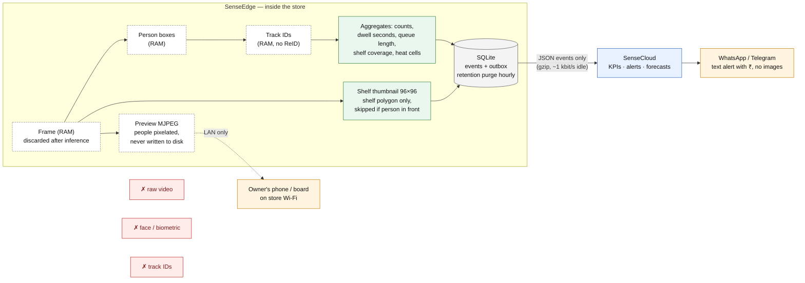

# RetailSense — Privacy by Design

**Statement shipped in `store.yaml` (`privacy.statement`):** *"No face recognition; no raw video persisted; track IDs never leave the edge."*

RetailSense counts, times and locates **people as anonymous moving boxes** and measures **shelves as coverage percentages**. It never identifies a shopper, never stores a frame, and never sends an image of a person anywhere. This document states exactly what is and is not processed, how long anything is kept, how that maps to India's Digital Personal Data Protection Act 2023, and the signage a store must display.

---

## 1. What is processed, what is stored, what leaves the store

| Data | Processed on edge (RAM) | Stored on edge | Sent to cloud | Notes |
|---|---|---|---|---|
| Raw camera frames | Yes — sampled at 2–5 fps, discarded after inference | **No** | **No** | `FrameSource.read()` → detector → frame reference dropped; `/preview` is generated live and never written to disk |
| Person bounding boxes + confidence | Yes | No | No | Ephemeral `Detection` objects per frame |
| Track IDs (integers) | Yes — ByteTrack-style Kalman + IoU association, **no appearance embedding, no ReID** | No (in-memory only) | **No** | `DwellSample` deliberately has no track id; ids are never reused and die with the process |
| Faces / biometrics / gender / age / clothing | **Never computed** | No | No | No face detector or embedding model is present in the manifest (`task ∈ person_detect, shelf_gap, sku_embed`) |
| Footfall crossings, zone occupancy, dwell durations | Yes | Yes (aggregates, 30 days) | Yes | Counts and seconds only |
| Floor heatmap | Yes | Yes (20 px floor cells per hour, 90 days) | Yes | Aggregated per hour bucket; cannot reconstruct a path |
| Queue snapshots / forecasts | Yes | Yes | Yes | Counts, rates, wait estimates |
| Shelf coverage / facings / state | Yes | Yes | Yes | Numbers per shelf polygon |
| Shelf thumbnails | Yes | Yes (7 days) | Yes (optional, `privacy.shelf_thumbnails`) | **96×96 JPEG of the shelf polygon only**, ≤ 16 KB; a scan is skipped entirely when a person overlaps the shelf polygon ≥ 30 % (`occlusion_skip_overlap`), so a thumbnail cannot contain a shopper |
| Preview stream (`/preview/{cam}.mjpg`) | Yes | **No** | No | People pixelated (downscale 12× / upscale) when `preview_blur_people` is true (default); LAN only |
| Alerts (Hindi/English text, ₹ impact) | Yes | Yes (365 days) | Yes | Contain SKU names and counts, no personal data |
| Owner's WhatsApp number | – | Yes (config) | Yes (dispatcher) | The **store owner's** business contact, provided by the owner |
| Device telemetry (fps, backlog, CPU) | Yes | 24 h | Yes | Operational only |

Dashed nodes exist only in RAM. Nothing marked ✗ exists at any stage.

---

## 2. Design commitments

1. **No face recognition, ever.** The person detector outputs class-0 boxes only; no face, gender, age, emotion or re-identification model is in the OTA manifest, and adding one would require a manifest change reviewed in the fleet console.
2. **Appearance-free tracking.** ByteTrack-style association on motion and IoU only (EDGE_CV_STACK §Privacy: "only ephemeral integer track IDs; no biometric embedding ever computed"). `with_reid=False` is structural, not a flag.
3. **Track IDs never leave the edge.** Every event type that crosses the network was designed without a track id; `DwellSample{zone_id, dwell_s, entered_ts, exited_ts}` is the canonical example.
4. **No raw video persisted.** Frames live only in the worker thread; previews are rendered on request and pixelated; shelf thumbnails are masked to the shelf polygon and skipped when a person is in front.
5. **Minimisation in the data model.** Heatmaps are hour-bucketed 20 px floor cells; queue data are counts and durations; footfall is a line-crossing counter.
6. **Retention enforced by code.** `RetentionJob` runs hourly and purges per the table in §3; `privacy.RetentionPolicy` is part of the validated config.
7. **Transparency to shoppers and owners.** Signage (§5) at the entrance; the owner's dashboard shows the privacy statement and the retention policy in effect.
8. **Security.** Per-device token on ingest, sha256-verified models, HTTPS via nginx in production, no inbound ports to the store (commands ride the ingest ack).

---

## 3. Retention policy (`RetentionPolicy` defaults; editable per store)

| Data class | Where | Retention | Purge mechanism |
|---|---|---|---|
| Raw frames | Edge RAM | 0 — never stored | Reference dropped after inference |
| Track IDs | Edge RAM | Lifetime of the track (seconds–minutes) | Process memory; not serialised |
| Telemetry events (`device.heartbeat`, `heatmap.tiles` raw, `sim.truth`) | Edge SQLite | **24 hours** | `RetentionJob` hourly; also expires from outbox after 1 h if unsent |
| Aggregate events (crossings, occupancy, dwell, queue, shelf) | Edge SQLite | **30 days** | `RetentionJob` hourly |
| Shelf thumbnails (`thumb_b64` in `shelf.scan`) | Edge SQLite + cloud | **7 days** | Field nulled in place, event retained without image |
| Heatmap cells (hour-bucketed) | Edge + cloud | **90 days** | `RetentionJob` |
| Alerts (text + ₹ impact) | Edge + cloud | **365 days** | Business record for the owner |
| Sent outbox rows | Edge SQLite | **24 hours** | `RetentionJob` |
| Daily KPI rollups (`kpi_daily`) | Edge + cloud | Indefinite (no personal data — 17 numbers per day) | Owner may delete the store |
| Owner WhatsApp number | Config + cloud notifications | Until the owner deletes the store | `DELETE` store on request |

---

## 4. DPDP Act 2023 mapping

Our reading of the Digital Personal Data Protection Act, 2023 as applied to RetailSense; the store owner is the **Data Fiduciary** for any personal data in their store, RetailSense operates as a **Data Processor** for cloud-hosted aggregates. This is an engineering mapping, not legal advice; a pilot includes counsel review.

| DPDP provision (Act, 2023) | Requirement | RetailSense position |
|---|---|---|
| §2(t) definition of "personal data" — data about an individual who is identifiable by or in relation to such data | Only identifiable data is regulated | Counts, durations, coverage percentages and hour-bucketed heat cells identify nobody; raw frames (which could identify) exist only transiently in RAM and are never stored or transmitted |
| §4 lawful processing — consent or "certain legitimate uses" | A lawful basis for any personal-data processing | Transient frame processing for statistical counting is framed as a legitimate use with data minimisation (EDPB 3/2019 analogue for video analytics without retained identifiable footage); no biometric processing, so no explicit-consent trigger |
| §5 notice | Tell data principals what is processed and why | Entrance signage (§5 below) in Hindi + English; privacy statement on the dashboard |
| §6 consent | Free, specific, informed, unambiguous where consent is the basis | Not required for anonymous statistics; if a store ever enabled an identifying feature, consent UX would be mandatory — RetailSense ships none |
| §8(4)–(5) Data Fiduciary obligations — accuracy, reasonable security safeguards | Protect data, prevent breach | Per-device tokens, sha256 model verification, HTTPS, no raw video, no inbound ports; breach surface is numbers only |
| §8(7) erasure when purpose is served | Delete data no longer necessary | Code-enforced retention table (§3); hourly purge job; store deletion removes config and notifications |
| §9 children's data | No tracking/behavioural monitoring of children | No individual tracking or profiling of anyone; aggregate counts cannot single out a child |
| §11–§13 rights of access, correction/erasure, grievance | Data principals can exercise rights | No individual-level records exist to access or correct; signage lists the owner's contact for grievances; owner can request store deletion |
| §16 cross-border transfer | Transfers only to non-restricted countries | Cloud hosted in India (pilot: Indian region VM); edge data never leaves the store by default |
| Significant Data Fiduciary (§10) | Extra obligations for high-volume/high-risk processing | Not triggered: no biometric, no profiling, no individual records |

**Comparison with typical retail analytics:** facial-recognition footfall systems process biometric data (explicit consent, high risk). RetailSense's architecture makes that class of obligation structurally impossible to trigger, which is both the compliance argument and the adoption argument for kirana owners who do not want to be "surveilling customers".

---

## 5. Signage template (print at the entrance, A4, both languages)

**English**

> **This store uses camera analytics to count customers and check shelves.**
> The system counts people and measures queue lengths and shelf stock. It does **not** recognise faces, does **not** store video, and does **not** identify anyone. Only anonymous numbers (counts, waiting times, shelf stock levels) are kept. Numbers are kept for up to 30 days; daily summaries longer.
> Questions or concerns: contact the store owner at _____________ (phone). Data Fiduciary: _____________ (store name).

**हिन्दी**

> **यह दुकान ग्राहकों की गिनती और शेल्फ की जाँच के लिए कैमरा-आधारित विश्लेषण का उपयोग करती है।**
> यह सिस्टम लोगों की गिनती करता है और लाइन की लंबाई तथा शेल्फ पर सामान की मात्रा मापता है। यह चेहरे **नहीं** पहचानता, वीडियो **नहीं** रखता, और किसी की पहचान **नहीं** करता। केवल अनाम संख्याएँ (गिनती, इंतज़ार का समय, शेल्फ स्टॉक) रखी जाती हैं। संख्याएँ अधिकतम 30 दिन तक रखी जाती हैं; दैनिक सारांश उससे अधिक।
> प्रश्न या शिकायत के लिए: दुकान मालिक से संपर्क करें _____________ (फ़ोन)। डेटा फ़िड्यूशियरी: _____________ (दुकान का नाम)।

---

## 6. Verifiable claims (how a judge can check)

| Claim | How to verify in the build |
|---|---|
| No face model | `models/manifest.json` lists only `person_detect` / `shelf_gap` / `sku_embed` tasks; grep the repo for any face library — none |
| Track IDs never leave the edge | `retailsense_contracts.events` payloads contain no `track_id` field; `test_events_roundtrip` covers every event type |
| No raw video persisted | `annotate_frame`/`PreviewStreamer` tests assert nothing is written to disk; the edge DB schema has no blob column except `sku_enrolment.embedding` (product images, P2) |
| Thumbnails are shelf-only and small | `test_thumbnail_size_limits` (≤ 96×96, ≤ 16 KB); `test_occluded_scan_ignored` |
| Preview pixelation | `test_annotate_blur_changes_person_pixels_only` |
| Retention enforced | `test_retention_purge` counts purged rows per class |
